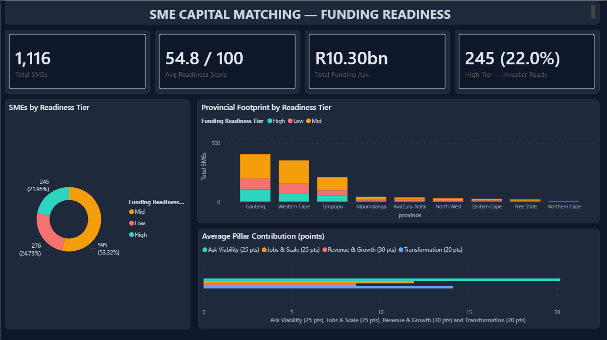
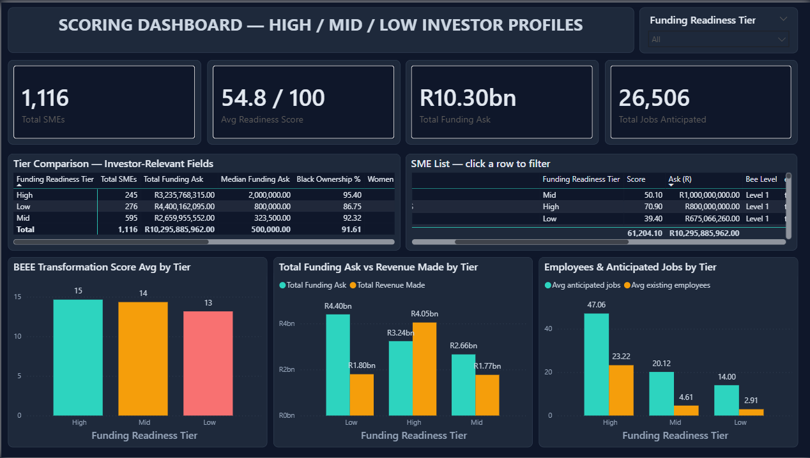
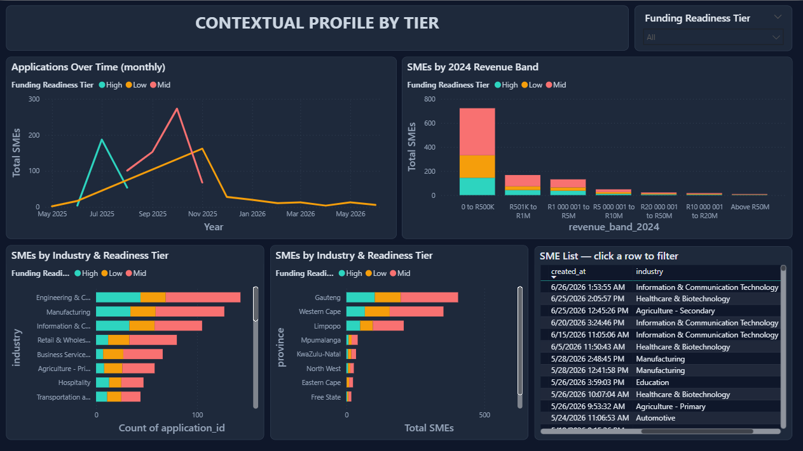

### Overview

**The JSE's SME Capital Matching Initiative is a campaign that connects small businesses with investors so that they can be provided with capital to support their growth. In 2025, the initiative received more than 1,100 applications from SMEs that wish to receive capital funding from investors.**

**This number is too large for the SME Management team to review efficiently to connect them with investors, which leads to a low conversion rate. To address this, I've built a data workflow that ingests the SME applications, cleans the messy data, and scores and sorts each SME applicant into three tiers (High, Mid, and Low) that determine which of them are the most viable for funders to invest capital into.**

**The goal is to increase the campaign's conversion rate by identifying the most investable SMEs and presenting them to funders first. A further goal was to provide the SME team with clear evidence to attract new investors into the initiative. Each early and successful SME - to - funder deal strengthens the reputation of the initiative and supports the JSE's wider SME outreach.**

### What was uncovered

**The workflow identified 245 SMEs in the High tier, 595 in the Mid tier, and 276 in the Low tier. The 245 High tier SMEs are the most ready to receive funding. This shortlist is larger than the number of SMEs the programme actually matched with funders in previous rounds, which was 90 in the 2023 pilot and 190 in 2024 — though a ready shortlist and a completed match are not the same measure. For this reason, the High tier is where investors should begin. As a group, these SMEs altogether generated R4.05 billion in revenue while requesting R3.24 billion in capital, which means they are requesting less than they currently earn. This indicates a realistic and low risk profile. In total, they employ 5,690 people and collectively project 11,436 new jobs. They hold strong B-BBEE credentials, with an average of 95% black ownership. These SMEs applied steadily throughout the campaign, in every month of the run. As a result, they can be presented to investors immediately.**

### Value delivered

**The project provides the SME team with two assets. The first is a repeatable data segmentation model that ranks every future group of applicants automatically, together with a clear strategy to manage each tier. The team can fund the 245 High tier SMEs now, support the growth of the 595 Mid tier businesses, and develop the 276 Low tier applicants for future funding. The second asset is a set of evidence that the team can present to prospective investors. In summary, the workflow converts 1,116 applications into both an internal list of priorities and an external case for investment.**

**Note**: The original dataset has been sanitised. Read the details by the [**About the data section**](#about-the-data)

---

## Project Artifacts

| File                                                                                                                             | Description                                                           |
| -------------------------------------------------------------------------------------------------------------------------------- | --------------------------------------------------------------------- |
| [Datasets/capital_matching_applications.csv](Datasets/capital_matching_applications.csv)                                          | The raw, messy (synthetic) dataset                                    |
| [Python_Notebooks/Data_Cleaning.ipynb](Python_Notebooks/Data_Cleaning.ipynb)                                                      | The data cleaning workflow, documented with write-ups for each step |
| [Python_Notebooks/Funding_Readiness_Segmentation.ipynb](Python_Notebooks/Funding_Readiness_Segmentation.ipynb)                    | The scoring model and tier segmentation                               |
| [Datasets/Capital_Matching_Cleaned_Data.xlsx](Datasets/)                                                                          | The cleaned dataset                                                   |
| [Datasets/Funding_Readiness_Segmentation.xlsx](Datasets/)                                                                         | The model data set, with every SME scored, tiered and ranked          |
| [SME_Capital_Matching_Dashboard.pbix](SME_Capital_Matching_Dashboard.pbix)                                                        | Power BI dashboard built on the segmented data                        |
| [Data Cleaning Walkthrough (PDF)](Documents/Reports/Data_Cleaning_Walkthrough.pdf)                                                   | How the messy data was diagnosed and repaired in Python               |
| [Business Case (PDF)](Documents/Reports/Business_Case.pdf)                                                                           | The situation, the problem, the approach proposed, and the goal        |
| [Insights & Actionable Decisions (PPTX)](Documents/Reports/Insights_&_Actionable_Decisions.pptx)                                     | Segmentation findings, tier-by-tier actions, and the case for capital partners |
| [Download the entire project (.zip)](https://github.com/MainDevWork/SME_Capital_Funding_Optimization/archive/refs/heads/main.zip) | Every file in this repository, bundled as a single ZIP download       |

## Data sources and scope

Every figure in this project traces back to a single file: the export of applications submitted to the JSE's [SME Capital Matching](https://www.jse.co.za/services/sme-rise/sme-capital-matching-initiative) online form. That export is the only input; the two notebooks and the dashboard are all built from it.

**Where the data comes from.** Each row is one funding application, self-reported by the business through a public web form. Nothing is drawn from external registries or credit bureaus — the analysis works entirely with what the applicant chose to disclose, which is exactly the position the SME team is in when it decides who to advance.

**Period and volume.** The applications span **29 May 2025 to 26 June 2026**. The raw export holds **1,186 rows**, which resolve to **1,116 unique businesses** once exact copies and re-submissions are removed.

**A note on reproducibility.** The figures quoted in this README and in the insights deck come from the live application dataset, which is confidential and is not published in this repository. The notebooks are committed with a synthetic dataset of the same shape, so the code runs end to end for anyone who clones the repo — but the tier counts it produces (**273 / 568 / 275**) will not match the figures quoted here (**245 / 595 / 276**). The scoring model, pillar weights and tier thresholds are identical in both cases.

**Fields captured.** The form collected **27 fields** per application. The ones that drive the analysis fall into five groups:

| Group               | Fields used                                                      |
| ------------------- | ---------------------------------------------------------------- |
| Identity & location | Company name, registration number, province, city/town, industry |
| Funding request     | Amount requested, type of funding, purpose of funding            |
| Financial history   | Annual revenue bands for 2023 and 2024, actual 2025 revenue      |
| Scale & impact      | Existing employees, anticipated new jobs, number of shareholders |
| Transformation      | B-BBEE level, and Black, women, youth and disability ownership   |

**A word on quality and scope.** The form exported clean-looking headers but messy values: funding amounts padded with trailing underscores (`250000_________`), revenue recorded as text bands rather than numbers, one province recorded under two different names (`KZN` alongside `KwaZulu-Natal`), malformed registration numbers, free text sitting in numeric fields, duplicate submissions, and blanks in fields investors require. Roughly one field in ten arrived unusable as captured. Repairing that data — without discarding businesses for gaps the form itself created — is the first half of the work; scoring what remains is the second. The dataset published here is a sanitised stand-in for the confidential original; the [About the data](#about-the-data) section explains exactly how and why.

## Methodology

The workflow runs end to end from the raw file, in two documented notebooks that hand off through a single Excel file. Both notebooks are written as instructional documents — every code cell is preceded by a plain-language explanation — so a non-technical reader can follow what is done and why, and re-running them on the same input reproduces the same output exactly.

```
Datasets/capital_matching_applications.csv      raw form export — 1,186 rows × 27 columns
        │
        ├─ Python_Notebooks/Data_Cleaning.ipynb
        │     Rename 27 survey headers to tidy names (kept as a data dictionary).
        │     Strip underscore padding and parse money text into clean Rand figures.
        │     Cap implausible outliers (any value above R2bn treated as a capture error).
        │     Convert revenue text-bands to an ordered 0–6 scale with Rand midpoints.
        │     Convert ownership bands to numbers; extract the B-BBEE level.
        │     Standardise province spellings (KZN → KwaZulu-Natal); tidy cities and emails.
        │     De-duplicate: 68 exact copies and 2 re-submissions removed.
        ▼
Datasets/Capital_Matching_Cleaned_Data.xlsx     clean, analysis-ready — 1,116 × 41
        │
        ├─ Python_Notebooks/Funding_Readiness_Segmentation.ipynb
        │     Score four pillars (0–1 each), apply weights, sum to a 0–100 readiness score.
        │     Assign a tier (High / Mid / Low) and rank every business, where 1 = most ready.
        ▼
Datasets/Funding_Readiness_Segmentation.xlsx    scored, tiered and ranked — 1,116 × 24
        │
        └─ SME_Capital_Matching_Dashboard.pbix   Power BI: tier, industry and province views
```

### Step 1 — Cleaning and preparation

The cleaning notebook is where the messy export becomes a table the model can trust. It renames all 27 survey headers to short names (retained as a data dictionary), strips the underscore padding from money fields and parses them into real Rand values, caps any amount above R2 billion as a capture error, maps each revenue text-band onto an ordered 0–6 scale with a representative Rand midpoint, converts the four ownership percentage bands to midpoint numbers, extracts the numeric B-BBEE level, standardises the nine province spellings, and lowercases emails so duplicates can be matched. Two de-duplication passes then remove 68 exact copies and 2 re-submissions. The recovery is stark: usable funding-amount values rise from **10 to 1,109**, and usable 2025 revenue figures from **0 to 1,112**.

### Step 2 — The scoring model

Each business receives a **Funding Readiness Score from 0 to 100**, built from four weighted pillars drawn only from fields the form already collects. Each pillar is calculated as a value between 0 and 1, multiplied by its weight, and the four results are summed.

| Pillar                  | Weight       | The question it answers                      | How it is scored                                                                              |
| ----------------------- | ------------ | -------------------------------------------- | --------------------------------------------------------------------------------------------- |
| Revenue & Growth        | **30** | Is this a real, growing business?            | 60% revenue size (latest band ÷ 6), 40% year-on-year band movement                           |
| Jobs & Scale            | **25** | Is it trading, and will funding create jobs? | 55% current employees, 45% anticipated jobs, both log-scaled so a count of 50 = full marks    |
| Funding-Ask Viability   | **25** | Is the ask sensible, and the form complete?  | 60% ask-to-revenue ratio (0.5×–5× is the target range), 40% completeness of ten key fields |
| Transformation (B-BBEE) | **20** | What are the transformation credentials?     | 50% B-BBEE level, 50% average of the four ownership percentages                               |

**The weightings reflect what funders act on.** Revenue and growth carry the most weight because they are the clearest evidence of a genuine business. Jobs and funding viability follow, because a proportionate request from an operating employer is what a funder can actually structure. Transformation carries the lowest weight — not because it matters least, but because the pool is already highly transformed (an average of roughly 92% Black ownership across the pool), so it separates one applicant from another less than the other three pillars. It is retained because it is a genuine requirement in many funders' mandates.

**One fairness rule governs every pillar: a missing answer is scored as neutral (0.5), never as zero.** No business is penalised for a question the form failed to capture. The two deliberate exceptions — where a blank genuinely means "none" — are a reported revenue of nothing (read as pre-revenue) and a blank headcount or job figure (read as no employment recorded).

### Step 3 — Tiering

Fixed score thresholds convert the score into three tiers, so a tier keeps the same meaning when future rounds are scored:

| Tier           | Score   | Definition                                                             | Recommended action                                                           |
| -------------- | ------- | ---------------------------------------------------------------------- | ---------------------------------------------------------------------------- |
| **High** | 62–100 | Established, credible businesses making appropriately sized requests   | Package and present to investors immediately                                 |
| **Mid**  | 48–61  | Genuine operating businesses with specific, addressable gaps           | Develop: provide readiness support, right-size the ask, and re-score         |
| **Low**  | 0–47   | Early-stage businesses, or applications with material information gaps | Remediate before any introduction: complete the data and recalibrate the ask |

Every business is also given a rank where 1 = most ready, with ties settled alphabetically so the same data always produces the same file. The full formula for each pillar, with a worked example traced end to end, is documented cell by cell inside [Funding_Readiness_Segmentation.ipynb](Python_Notebooks/Funding_Readiness_Segmentation.ipynb).

## Tools and technologies

| Tool                             | Role in the project                                     |
| -------------------------------- | ------------------------------------------------------- |
| **Python** (pandas, NumPy) | Cleaning, transformation and the scoring model          |
| **openpyxl**               | Writing the styled, tier-colour-coded Excel outputs     |
| **Jupyter Notebook**       | The documented, reproducible workflow for both stages   |
| **Microsoft Excel**        | The hand-off format the SME team already works in       |
| **Power BI**               | The three-page reporting layer built on the scored data |
| **Git / GitHub**           | Version control and publication of the project          |

The reporting layer uses a custom dark theme, [PowerBI_Dark_Modern_Theme.json](PowerBI_Dark_Modern_Theme.json), so each tier keeps the same colour on every page and the views can be read together.

## Key findings

Scoring all 1,116 businesses produces a clear three-tier shape. The High tier is small but immediately bankable, the Mid tier holds the bulk of the pipeline, and the Low tier is a defined remediation workload rather than a write-off. Across the whole pool the businesses request **R10.30bn** of capital, average a readiness score of **54.8 / 100**, and project **26,506** new jobs.

| Tier            | Businesses      | Share          | Total ask          | Total revenue     | Avg. employees | Avg. new jobs | Black ownership |
| --------------- | --------------- | -------------- | ------------------ | ----------------- | -------------- | ------------- | --------------- |
| High            | 245             | 22.0%          | R3.24bn            | R4.05bn           | 23.2           | 47.1          | 95.4%           |
| Mid             | 595             | 53.3%          | R2.66bn            | R1.77bn           | 4.6            | 20.1          | 92.3%           |
| Low             | 276             | 24.7%          | R4.40bn            | R1.80bn           | 2.9            | 14.0          | 86.8%           |
| **Total** | **1,116** | **100%** | **R10.30bn** | **R7.62bn** | —             | —            | 91.6%           |

The detail behind each headline is set out below, and reproduced visually in the Power BI report.

**1. The High tier is the low-risk core of the pipeline.** Only 22% of applicants reach it, yet it is the one tier that asks for **less than it earns** — **R3.24bn** requested against **R4.05bn** of revenue. These businesses employ roughly **5,690** people, project about **11,436** new jobs, and hold the strongest transformation profile in the pool (**95.4%** average Black ownership). This is an investor-ready shortlist that needs no further preparation.

**2. The Low tier asks for the most while earning the least.** Counter-intuitively, the least-ready tier carries the **largest total funding ask of all — R4.40bn** — against just **R1.80bn** of revenue, from the smallest businesses in the pool (an average of 2.9 employees). Its median request of **R800K** even exceeds the Mid tier's **R323.5K**. These are asks disproportionate to trading history, which no funder can underwrite as written, so right-sizing the request is the single highest-leverage intervention for the lower tiers.

**3. Projected job creation is substantial and concentrated.** The pool projects **26,506 new jobs** in total. The High tier alone accounts for roughly **11,436** of them — an average of **47 per business** — and, because those businesses already employ at scale, it is the tier most credible to deliver, making the employment and transformation case development-finance investors are mandated to fund.

**4. Transformation credentials are strong across the entire pool.** Average Black ownership is **91.6%**, and every tier scores highly on the B-BBEE pillar (**15, 14 and 13 of 20** for High, Mid and Low). This is commercially significant, because B-BBEE standing and inclusive ownership are precisely the criteria many investors are required to apply. The model surfaces these businesses rather than leaving them undifferentiated in a pool of a thousand.

**5. Quality holds steady while volume swings.** Application volume rose and fell across the campaign, but the High tier held a steady **17–28%** share of every month's applications. Investor-ready businesses arrived in all fourteen months, with two thirds of them — **161 of 245** — from September 2025 onward. Matching should therefore run continuously, rather than waiting for the campaign to close.

**6. Applications concentrate in three provinces.** **Gauteng, the Western Cape and Limpopo** account for the large majority of the pool, and the same three dominate the High tier. This tells the team where an in-person or targeted development effort would reach the most businesses.

The scored output feeds a three-page Power BI report. Each tier keeps its colour across every page, and the tier slicer filters a whole page at once.

**Funding Readiness (Executive Summary)** — the portfolio at a glance: KPI tiles for total SMEs (1,116), average readiness score (54.8 / 100), total funding ask (R10.30bn) and the size of the investor-ready High tier (245, 22.0%), alongside the tier split, the provincial footprint by tier, and each pillar's average contribution to the score.



**Scoring Dashboard — High / Mid / Low investor profiles** — the scoring view: KPI tiles including total jobs anticipated (26,506), a tier comparison of the investor-relevant fields, average B-BBEE transformation score by tier, total funding ask against revenue by tier, employees and anticipated jobs by tier, and a searchable SME list where clicking a row filters the page to that bsiness.



**Contextual Profile by Tier** — where the applicants come from and what they look like: applications over time, distribution across 2024 revenue bands, and industry and provincial breakdowns by readiness tier — the view used to decide which sectors and provinces warrant targeted development work.



## Recommendations

The tiers are not a ranking to be worked top to bottom; each calls for a different action, and running the three in parallel is what converts the pool into funded deals.

**Fund the High tier now.** The 245 High-tier businesses are investor-ready as they stand: substantive operations, meaningful headcounts, and — uniquely — requests smaller than their revenue. They should be packaged and taken to investors immediately, matched to mandates by sector, province and transformation profile. This tier alone already exceeds the number of businesses the programme matched in prior rounds, so it is where the fastest conversions — and the strongest reference stories for attracting new investors — will come from.

**Develop the Mid tier.** At 595 businesses, more than half the pool, this is the largest source of untapped value. These are genuine trading businesses whose shortcomings are specific and correctable — most often a request that needs right-sizing or a handful of missing fields. The right response is structured readiness support and a re-score, not rejection. Converting even a portion of this tier materially increases the number of businesses reaching investors, so it warrants the bulk of the team's development effort.

**Remediate the Low tier over time.** The 276 Low-tier businesses share two fixable problems: funding requests far out of proportion to revenue — this tier asks for R4.40bn, more than any other, against just R1.80bn of revenue — and incomplete applications. Both are resolved through direct engagement, completing the missing data and recalibrating the ask, after which the business is re-scored and can rise. This makes the tier a defined, prioritised remediation workload for later rounds rather than a write-off.

**Use the pipeline as an investor-attraction asset.** Beyond the internal priority list, the segmentation is evidence: a quantified, transformation-strong pipeline the team can put in front of prospective funders to draw new capital into the campaign.

## Limitations and assumptions

The model is deliberately transparent, which means its assumptions should be read alongside its results.

- **Self-reported, unverified data.** Every figure is what the applicant entered; nothing is confirmed against registries, financials or credit data. The score measures *readiness to present*, not creditworthiness — a funder's due diligence still follows.
- **Banded financials.** 2023 and 2024 revenue arrive as ranges, not exact figures, so the model uses representative midpoints. This is precise enough to rank and tier, but individual ratios are approximate.
- **Missing answers are neutralised, not penalised.** Blanks are scored at 0.5 so no business is punished for the form's gaps. The trade-off is that a genuinely incomplete application can score similarly to a merely modest one; the completeness component and the Low-tier remediation step are what catch this.
- **Fixed weights and thresholds.** The 30/25/25/20 pillar weights and the 62 / 48 tier cut-offs encode a defensible view of funding readiness, but they are choices. They live in one place in the notebook and can be re-tuned as the programme learns what converts.
- **Modelling caps.** Amounts above R2bn are treated as capture errors, ask-to-revenue scoring saturates beyond the target range, and job/employee scaling flattens above 50 — all sensible guards that intentionally compress the extremes.

## Next steps

- **Run each new round through the same pipeline.** Because the workflow is fully reproducible, every future intake of applications can be cleaned, scored and tiered on demand, keeping an investor-ready shortlist available at all times rather than after weeks of manual review.
- **Close the loop on outcomes.** As deals close, feed which tiers actually convert back into the model and re-tune the weights and thresholds against real conversion data.
- **Track businesses across rounds.** Re-scoring lets the team see Mid- and Low-tier businesses that improve after development support move up the tiers, turning the model into a progress tracker as well as a filter.
- **Extend the inputs.** Where consent and access allow, verified financials or registry checks could complement the self-reported fields and sharpen the higher tiers.

### About the data

**The dataset in this repository is synthetic,** but the data work flow that was used on the original data set has remained the same. The original data set were comprised of applications that contained real business names, named individuals, email addresses, telephone numbers and company registration numbers, and therefore cannot be published. Every identifying value has been replaced with a fictitious equivalent.

The following characteristics of the original data have been deliberately preserved, because they are precisely what the workflow exists to address:

- The original 27 column headers
- The same row count and duplicate structure (1,186 rows resolving to 1,116 unique businesses)
- The same categories of data-quality problem
- Similiar distribution of funding rediness tiers, so the model produces a portfolio shape comparable to the original.

The pipeline, the data cleaning, the scoring model and the dashboard remain the same and run unchanged against this data. **The dashboard screenshots and the headline figures in this README reflect the original dataset** (I paidcareful attention that no confidentail details were exposed). Re-running the published notebooks on the synthetic data reproduces the same workflow and a comparable portfolio shape, but the exact tier counts and totals will differ slightly from the confidential figures shown here, by design.

## Author and contact

**Ndivhuwo** — data analysis, modelling and dashboard.

- Email: [ndivhuwojse@gmail.com](mailto:ndivhuwojse@gmail.com)
- LinkedIn: [www.linkedin.com/in/ndivhuwo-makhavhu](https://www.linkedin.com/in/ndivhuwo-makhavhu)
- GitHub: [github.com/MainDevWork](https://github.com/MainDevWork)
- Project: [SME_Capital_Funding_Optimization](https://github.com/MainDevWork/SME_Capital_Funding_Optimization)

[**Back to the top**](#overview)
